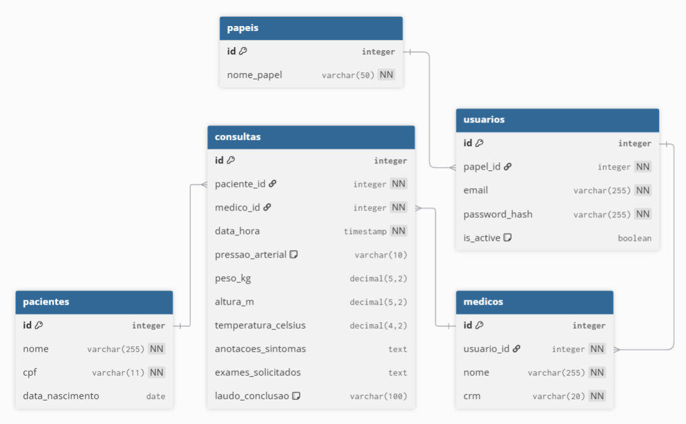

# 🏥 Sistema Clínico — Projeto de Programação Web II


---


## 📚 Sumário
- [🏥 Sistema Clínico — Projeto de Programação Web II](#-sistema-clínico--projeto-de-programação-web-ii)
  - [📚 Sumário](#-sumário)
  - [👩‍💻 Integrantes](#-integrantes)
  - [📖 Descrição do Projeto](#-descrição-do-projeto)
  - [🎯 Objetivos da Disciplina](#-objetivos-da-disciplina)
  - [⚙️ Tecnologias Utilizadas](#️-tecnologias-utilizadas)
  - [🧩 Etapas do Projeto](#-etapas-do-projeto)
    - [**Etapa 1:**](#etapa-1)
    - [**Etapa 2:**](#etapa-2)
    - [**Etapa 3:**](#etapa-3)
    - [**Etapa 4:**](#etapa-4)
    - [**Etapa 5:**](#etapa-5)
    - [**Etapa 6:**](#etapa-6)
    - [**Etapa 7:**](#etapa-7)
  - [🧠 Modelagem (Diagrama de Classes)](#-modelagem-diagrama-de-classes)
    - [Entidades principais:](#entidades-principais)
  - [🧭 Estrutura do Projeto](#-estrutura-do-projeto)
  - [🚀 Como Executar o Projeto](#-como-executar-o-projeto)
    - [1️⃣ **Clonar o repositório:**](#1️⃣-clonar-o-repositório)
    - [2️⃣ **Entrar na pasta do projeto:**](#2️⃣-entrar-na-pasta-do-projeto)
    - [3️⃣ **Configurar o banco de dados:**](#3️⃣-configurar-o-banco-de-dados)
    - [4️⃣ **Executar o projeto:**](#4️⃣-executar-o-projeto)
    - [5️⃣ **Acessar no navegador:**](#5️⃣-acessar-no-navegador)
  - [🧾 Licença](#-licença)

---

## 👩‍💻 Integrantes
| Nome | Função |
|------|---------|
| **Lucas Oliveira Garcez** | Desenvolvimento Back-end / Modelagem |
| **Eduardo Rodrigo da Silva Junior** | Desenvolvimento Front-end / Banco de Dados |

---

## 📖 Descrição do Projeto
O **Sistema Clínico** tem como objetivo gerenciar informações de pacientes, médicos e consultas, oferecendo funcionalidades como:

- Cadastro de pacientes e médicos;
- Registro de consultas com dados clínicos (peso, altura, pressão arterial, temperatura, etc.);  
- Emissão de relatórios em PDF contendo informações das consultas, laudo de conclusão e histórico de pacientes.  

O sistema será desenvolvido de forma **orientada a objetos** e com **camadas bem definidas**, aplicando os conceitos vistos na disciplina.

---

## 🎯 Objetivos da Disciplina
O projeto visa colocar em prática os conceitos aprendidos em **Programação Web II**, incluindo:

- Mapeamento objeto-relacional com **JPA/Hibernate**;  
- Implementação de **CRUDs completos**;  
- Criação de **controllers, services, repositories e views**;  
- Uso de **migrações com Flyway**;  
- **Validação de dados** no backend; 
- **Geração de relatórios em PDF** com sub-relatórios;  
- Utilização de **padrões de projeto** e boas práticas de arquitetura (MVC, camadas, etc.);  
- Implementação de **páginas de erro e paginação**.  

---

## ⚙️ Tecnologias Utilizadas
| Categoria | Tecnologias |
|------------|--------------|
| **Linguagem** | Java |
| **Framework Backend** | Spring Boot |
| **ORM / Persistência** | JPA / Hibernate |
| **Banco de Dados** | PostgreSQL |
| **Migrações** | Flyway |
| **Frontend** | Thymeleaf, HTMX, TailwindCSS, HTML, CSS, JavaScript |
| **Relatórios** | JasperReports |

---

## 🧩 Etapas do Projeto

### **Etapa 1:**  
**Apresentação do tema, integrantes e diagrama de classes**  
- Criação de um diagrama simplificado de classes (sem atributos/métodos).  
- Identificação das principais entidades e seus relacionamentos.  

### **Etapa 2:**  
**Implementação das classes do sistema**  
- Criação das classes Java de acordo com o diagrama definido na Etapa 1.  

### **Etapa 3:**  
**Mapeamento Objeto-Relacional (JPA)**  
- Implementação das anotações JPA nas classes do modelo.  
- Configuração inicial do banco de dados PostgreSQL e Flyway.  

### **Etapa 4:**  
**CRUD completo**  
- Implementação de controllers, services, repositories e views.  
- Operações de criação, leitura, atualização e exclusão.  

### **Etapa 5:**  
**Lógica de Negócios**  
- Implementação das regras de negócio da aplicação.  
- Validação de dados e integração entre entidades.  

### **Etapa 6:**  
**Relatório em PDF**  
- Geração de relatório com sub-relatórios (ex.: consultas de um paciente).  
- Exibição via interface web.  

### **Etapa 7:**  
**Apresentação Final**  
- Demonstração do sistema completo ao professor, mostrando:  
  - Classes do modelo  
  - Repositórios e migrações  
  - Controladores e serviços  
  - Views  
  - Lógica de negócios  
  - CRUDs, segurança e relatório  

---

## 🧠 Modelagem (Diagrama de Classes)

O diagrama abaixo representa uma **visão simplificada do modelo do sistema**:



### Entidades principais:
- **Pacientes**
- **Médicos**
- **Consultas**

**Relacionamentos:**
- Uma **consulta** está associada a um **paciente** e a um **médico**.  

---

## 🧭 Estrutura do Projeto

```
sistemaclinico/
│
├── src/
│   ├── main/
│   │   ├── java/
│   │   │   └── com/
│   │   │       └── sistemaclinico/
│   │   │           ├── aop/
│   │   │           ├── controller/
│   │   │           ├── filter/
│   │   │           ├── formatter/
│   │   │           ├── model/
│   │   │           ├── notification/
│   │   │           ├── pagination/
│   │   │           ├── repository/
│   │   │           ├── service/
│   │   │           └── validation/
│   │   └── resources/
│   │       ├── templates/                # Views Thymeleaf
│   │       ├── relatorios/               # Relatórios Jaspersoft
│   │       ├── static/                   # CSS, JS e imagens
│   │       ├── db/
│   │       │    └── migration/            # Scripts Flyway
│   │       ├── application.properties/   # Configurações do Spring
│   │       └── formatadores.properties   # Configurações dos formatadores
│   └── test/
│
├── pom.xml                               # Dependências Maven
├── README.md                             # Documentação do projeto
└── .gitignore                            # Arquivos ignorados pelo Git
```

---

## 🚀 Como Executar o Projeto
### 1️⃣ **Clonar o repositório:**
  ```bash
  git clone https://github.com/seuusuario/sistemaclinico.git
  ```

### 2️⃣ **Entrar na pasta do projeto:**
  ```bash
  cd sistemaclinico
  ```

### 3️⃣ **Configurar o banco de dados:**
Edite o arquivo `application.properties` com suas credenciais:
  ```bash
  spring.datasource.url=jdbc:postgresql://localhost:5432/sistemaclinico
  spring.datasource.username=postgres
  spring.datasource.password=suasenha
  ```

### 4️⃣ **Executar o projeto:**
  ```bash
  mvn spring-boot:run
  ```

### 5️⃣ **Acessar no navegador:**
  ```bash
  http://localhost:8080
  ```

---

## 🧾 Licença
📘Este projeto foi desenvolvido como parte da disciplina **Programação Web II** do curso de **Engenharia de Computação**.
Uso estritamente **acadêmico**.
